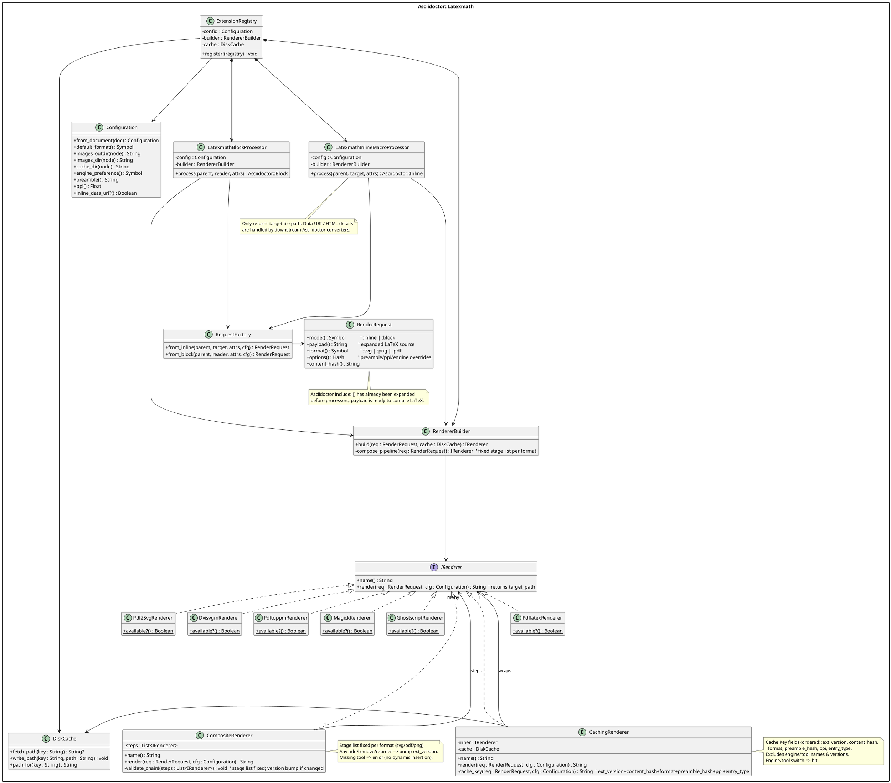

# asciidoctor-latexmath 系统设计

**修订日期:** 2025-10-03
**作者:** GitHub Copilot (助手)

## 背景与目标

asciidoctor-latexmath 为 Asciidoctor 提供离线 `latexmath` 渲染能力，复用开发者本地 LaTeX 工具链生成 PDF / SVG / PNG 静态资源。设计目标：

- 以 asciidoctor-diagram 为蓝本，提供熟悉的安装、注册与配置体验；
- 构建模块化、可扩展、可诊断的渲染流水线，严格遵循系统设计最佳实践；
- 在不读取源码的前提下，以文档与既有经验驱动设计，确保后续实现阶段可直接落地。

## 需求概述

> 2025-10-02 更新：依据宪法 v2.0.0 (P1 Processor Duo Only) 设计收缩为仅 BlockProcessor + InlineMacroProcessor；移除早期草案中的 BlockMacroProcessor 支持。

### 功能性需求
- 处理 `[latexmath]` 块 与 `latexmath:` 内联宏，仅使用 `BlockProcessor` 与 `InlineMacroProcessor`；显式不支持 `latexmath::` 块宏（宪法 P1）。
- 支持 `pdflatex`、`xelatex`、`lualatex`、`tectonic` 等编译器，允许按元素覆盖。
- 支持输出 `pdf` / `svg` / `png`，自动对接 `imagesdir` / `imagesoutdir` 与资源基名策略。
- 缓存渲染结果；缓存键仅包含（有序）`ext_version`、`content_hash`、`format`、`preamble_hash`、`ppi`（非 png 记 '-'）、`entry_type`（block|inline），不含引擎 / 转换工具名称及其版本（参见宪章 P5 / FR-011）。
- 覆盖 `AsciidoctorLatexmathAttributes.md` 列出的全部属性与选项，包括 `nocache`、`keep-artifacts` 等。

### 非功能性需求
- 渲染失败时提供可操作提示，指向日志及保留产物，支持 CI 与本地诊断。
- 在并行/多线程渲染下保持缓存目录安全，避免竞争条件。
- 以最小侵入方式融入 Asciidoctor 构建，允许运行于受限环境（如 CI、沙箱）。
- 预留可扩展接口，支持未来的 MathJax 回退、SVG 优化或新格式。

### 非目标
- 不进行 AsciiMath → LaTeX 的转换；沿用 Asciidoctor `stem` 语义。
- 不提供浏览器端渲染方案；专注于离线静态资产生产。

## 与 asciidoctor-diagram 的一致性策略

- **注册入口**：公开 `Asciidoctor::Latexmath::ExtensionRegistry.register!`，与 asciidoctor-diagram 的 DSL 调用方式完全一致。
- **配置命名**：沿用 `*-format`、`*-cache`、`*-cache-dir`、`pdflatex` 等属性前缀，可通过 CLI `-a` 和文档头设置。
- **缓存结构**：默认写入 `<outdir>/.asciidoctor/latexmath`，条目（产物 + metadata.json）键字段为最小集合（不含引擎 / 工具名称与版本）；支持 `latexmath-cache=false` / `%nocache`；引擎/工具切换不使缓存失效。
- **元数据**：生成 JSON manifest，记录命令行、文件哈希和尺寸信息，用于调试与增量构建。
- **目录策略**：优先 `imagesoutdir`，回退 `imagesdir`，再回退到文档目录；调试产物遵循 `latexmath-artifacts-dir`，与 asciidoctor-diagram 的 artifact 策略一致。

## 架构总览

架构分为六层，自顶向下依次解决注册、配置、处理器、请求构建、渲染以及具体工具执行：

1. **入口层** —— 扩展注册与共享依赖注入；
2. **配置与建造层** —— 解析属性、构建渲染器；
3. **处理器层** —— 块与内联 Processor 捕获 AST（无块宏，遵循宪法 P1）；
4. **请求层** —— 构造 `RenderRequest` 并计算缓存键；
5. **渲染抽象层** —— 组合、包装 Renderer；
6. **具体渲染器层** —— 调用外部命令完成格式转换。

### PlantUML 类图（已移除 pipeline_signature / BlockMacro）

## 渲染流程

1. **捕获阶段**：Processor 从 AST 收集 LaTeX 内容（块 / 内联），通过 `RequestFactory` 构造 `RenderRequest`。解析元素属性、`%nocache` / `cache=` 等标记，补齐请求上下文。
2. **渲染器选择**：`RendererBuilder` 基于格式选择 *固定阶段列表* 生成 `CompositeRenderer`；`CachingRenderer` 包裹结果，先查 `DiskCache` 再决定是否执行。
3. **管线执行**：`CompositeRenderer` 顺序执行管线步骤，例如 `PdflatexRenderer` → `Pdf2SvgRenderer` 或 `PdflatexRenderer` → `MagickRenderer`。每一步产生的文件通过临时目录管理，符合 `latexmath-keep-artifacts` 策略。
4. **产物处理**：渲染成功后写入 `imagesoutdir`，生成 JSON 元数据（尺寸、checksum、生成时间），不记录命令版本；需要时保留 `.tex`/`.log`。
5. **集成返回**：Processor 构造图像块或内联节点；v1 仅文件引用（data URI 行为由核心 `:data-uri:` 决定，扩展不主动生成 data: URL）。

## 组件职责

### Layer 0 — ExtensionRegistry
- 注册三个 Processor，并注入共享 `Configuration`、`RendererBuilder` 与 `DiskCache` 实例。
- 与 Asciidoctor logger 集成，初始化统计指标（渲染次数、缓存命中率）。

### Layer 1 — Configuration & RendererBuilder
- `Configuration.from_document` 读取文档级属性，计算默认格式、缓存目录、artifact 目录及 inline data URI 策略。
- `RendererBuilder` 负责：
  - 固定阶段装配：format → 预定义阶段序列（如 svg: [Pdflatex, Pdf→Svg]）。
  - 阶段序列调整需伴随 ext_version bump 与测试更新。
  - 外部命令检测：仅判断可用性；缺失报错，不回退次级阶段。

### Layer 2 — Processors
- `LatexmathBlockProcessor`：构造 `Asciidoctor::Block` 结果，支持 `[%nocache]`、`options="keep-artifacts"` 等开关。
- `LatexmathInlineMacroProcessor`：输出内联节点，必要时将目标资源封装成 data URI。
- 不实现 BlockMacroProcessor；`latexmath::` 语法被忽略或记录一次警告（与 Clarifications 一致）。
- 两类 Processor 均不使用 `TreeProcessor`，符合约束。

### Layer 3 — RequestFactory & RenderRequest
- 将 Asciidoctor 属性映射为请求选项（preamble、engine、format、cache-dir、png dpi）。
- 生成 `content_hash`，结合 `Configuration` 形成缓存键，保证不同 preamble / 引擎 / 格式不会误命中。
- 负责规范化输出基名、处理 `target` 覆写、内联命名属性。

### Layer 4 — Renderer 抽象
- `IRenderer` 定义最小接口；所有 Renderer 返回最终产物路径。
- `CompositeRenderer` 按顺序执行若干 Renderer，每个步骤都校验输入/输出类型以捕捉配置错误。
- `CachingRenderer` 调用 `DiskCache`，缓存键字段：ext_version, content_hash, format, preamble_hash, ppi, entry_type；不含引擎/工具名称或版本。

### Layer 5 — 具体 Renderer
- `PdflatexRenderer`：负责 `.tex` → `.pdf`，读取 `pdflatex`、`latexmath-preamble`、`latexmath-keep-artifacts`。
- `Pdf2SvgRenderer` / `DvisvgmRenderer`：执行 PDF → SVG；优先 `dvisvgm`，可强制覆盖为 `pdf2svg`。
- `PdftoppmRenderer` / `MagickRenderer` / `GhostscriptRenderer`：执行 PDF → PNG，尊重 `latexmath-ppi`。
- 所有 Renderer 记录命令行、工作目录、耗时，供元数据与日志使用。

## 缓存与元数据

-- `DiskCache` 以内容寻址的目录结构存储：
  - `cache/<digest>/artifact`：最终文件；
  - `cache/<digest>/metadata.json`：`{version,key,format,content_hash,preamble_hash,ppi,entry_type,created_at,checksum,size_bytes}`。
- 支持：
  - 文档级 `:latexmath-cache: false` 或元素级 `cache=false`、`%nocache`；
  - `latexmath-cache-dir` 覆写缓存位置，兼容 asciidoctor-diagram；
  - 并发加锁：使用 `File.flock` 或原子 `Dir.mktmpdir` + `FileUtils.mv`。失败时抛出带路径提示的异常。
- 元数据中记录的校验和可协助判断缓存腐化；CLI 提供清理子命令（待后续实现）。

## 属性支持矩阵

| 属性 / 选项 | 生效层级 | 解析组件 | 消费组件 |
| --- | --- | --- | --- |
| `stem` | 文档 | 用户配置（外部） | 启用 Processor 注册 |
| `latexmath-format` / 元素级 `format=` | 文档 / 元素 | Configuration / RequestFactory | RendererBuilder（决定管线） |
| `latexmath-cache` / `%nocache` / `cache=` | 文档 / 元素 | Configuration / Processors | CachingRenderer / DiskCache |
| `latexmath-cache-dir` / `cache-dir=` | 文档 / 元素 | Configuration | DiskCache |
| `latexmath-preamble` / `preamble=` | 文档 / 元素 | RequestFactory | PdflatexRenderer |
| `latexmath-keep-artifacts` / `keep-artifacts` 选项 | 文档 / 元素 | Configuration / Processors | PdflatexRenderer、CompositeRenderer（保留临时文件） |
| `latexmath-artifacts-dir` / `artifacts-dir=` | 文档 / 元素 | Configuration | RendererBuilder（决定落盘路径） |
| `pdflatex` | 文档 / 元素 | Configuration / RequestFactory | PdflatexRenderer |
| `latexmath-pdf2svg` / `pdf2svg=` | 文档 / 元素 | RequestFactory | Pdf2SvgRenderer、DvisvgmRenderer |
| `latexmath-png-tool` / `png-tool=` | 文档 / 元素 | RequestFactory | PdftoppmRenderer、MagickRenderer、GhostscriptRenderer |
| `latexmath-ppi` / `ppi=` | 文档 / 元素 | RequestFactory | PNG 渲染器 |
| 内联 `inline_data_uri`（待扩展） | 文档 | Configuration | LatexmathInlineMacroProcessor |

所有属性均支持 CLI `-a` 覆写，与 asciidoctor-diagram 的属性模型保持一致。

## 错误处理与可观测性

- 每次命令执行都捕捉 stdout/stderr，失败时抛出包含命令、退出码、日志路径的异常；日志建议写入 `metadata.json`。
- 提供统计接口：渲染耗时、缓存命中率、命令可用性。可通过 Asciidoctor 的 logger 输出 INFO / DEBUG 日志。
- 内建超时（默认 120s，可后续属性化）。超时后清理临时目录并提示用户调整工具链。
- `keep-artifacts` 打开时，将 `.tex`、`.log`、中间 PDF 复制到 artifacts 目录并在日志中提示路径。

## 并发、安全与可扩展性

- 缓存写入前先在临时目录渲染，再以原子移动写入缓存，避免重复计算。
- 对外部命令路径进行白名单校验，阻止注入；默认禁用 `\write18`（通过 `-no-shell-escape`），用户可显式开启（未来扩展属性）。
- 管线可注入额外 Renderer（如 SVG 优化器），只需实现 `IRenderer` 并在 `RendererBuilder` 注册。
- 未来可新增远程渲染后端，只需让 `IRenderer` 返回远程生成的文件路径或缓存拷贝。

## 开发迭代建议

1. **MVP**：实现 `ExtensionRegistry`、两类 Processor、`Configuration`、`RendererBuilder`、`PdflatexRenderer` + `Pdf2SvgRenderer` + `CachingRenderer`，完成 SVG 基线。
2. **PNG 支持**：接入 `latexmath-png-tool` 探测与管线，验证 DPI 处理与缓存签名。
3. **诊断增强**：落地 metadata JSON、统计指标、`keep-artifacts` 文件保留策略。
4. **生态优化**：补充 README、示例、CI 检查；探索 MathJax fallback 与失败后的 degrade 行为。

## 风险与缓解

- **工具链差异**：引擎/转换工具差异可能造成字节级差异 → 文档警示 + 建议固定单一工具链；缓存键不含工具名称避免失效。
- **缓存错配**：字段遗漏造成错误命中 → 最小字段集合 + 测试（引擎切换稳定性）防止回归。
- **结构变更未 bump**：阶段调整却复用旧缓存 → 阶段守护测试 + review checklist。
- **性能瓶颈**：首次渲染多 → 利用缓存热路径 O(N)，统计行度量命中 / 渲染耗时。
- **安全风险**：LaTeX 外部命令 → 默认禁止 shell-escape，参数白名单 + 超时。

## 结论

新版设计采用更新后的 `class-digram-v2.plantuml`（移除 pipeline_signature），以固定阶段列表 + 最小缓存键策略支撑 Processor → Request → Renderer 的模块化流水线，保持与 asciidoctor-diagram 的使用体验一致并提升确定性与可维护性。
